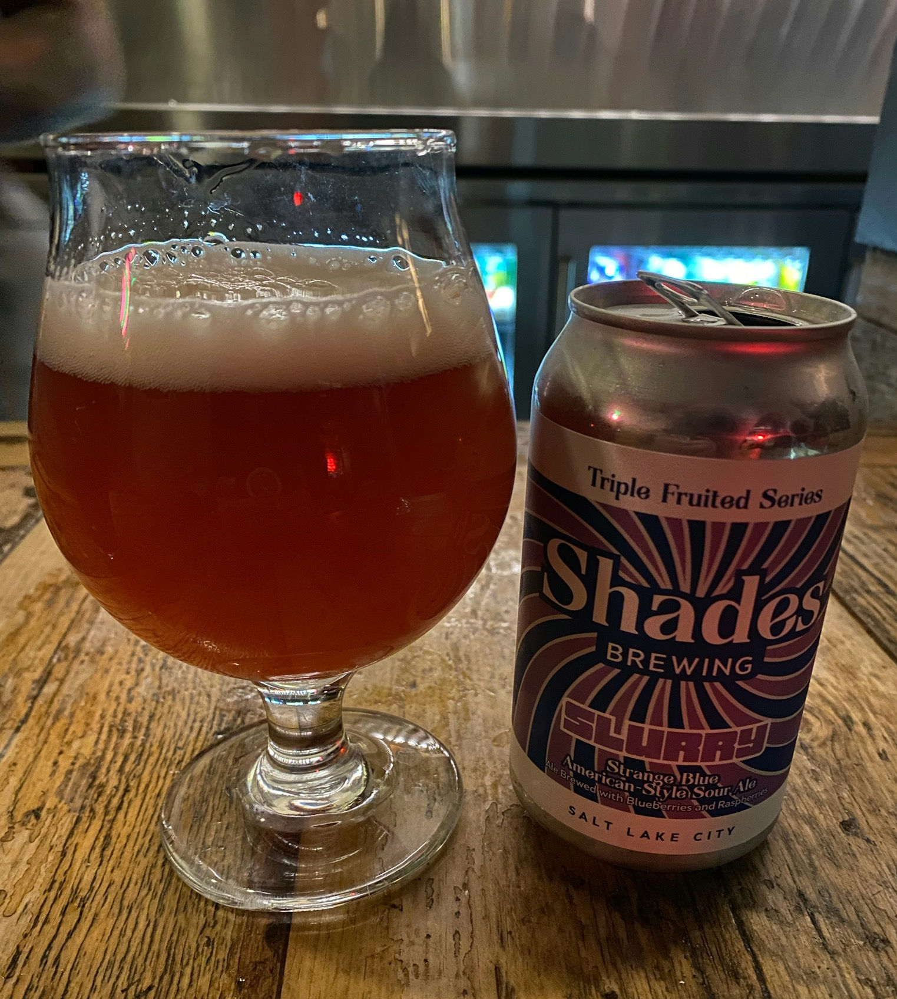

## I'm Blue
Every time I drink something with the flavor _**blue**_ I'm taken back to the simple days of being a kid. Shade's *Slurry Strange Blue American-Style Sour Ale* is no exception. Immediately it hits your tongue with the classic *blue-ness* that you would expect from a Gatorade or other drinks. 

Can you taste the raspberry? **No**  
Can you taste the blueberry? **No**  
Can you taste the blue? **Hell Yeah!**  

## Sour
I would consider this a **mild** sour as you can take big gulps with minimal puckering. It may even be possible to drink two of these in a row which is pretty wild compared to Shade's other sours.

## Overall Result
✅

(Insert picture of me drinking with a thumbs up here)