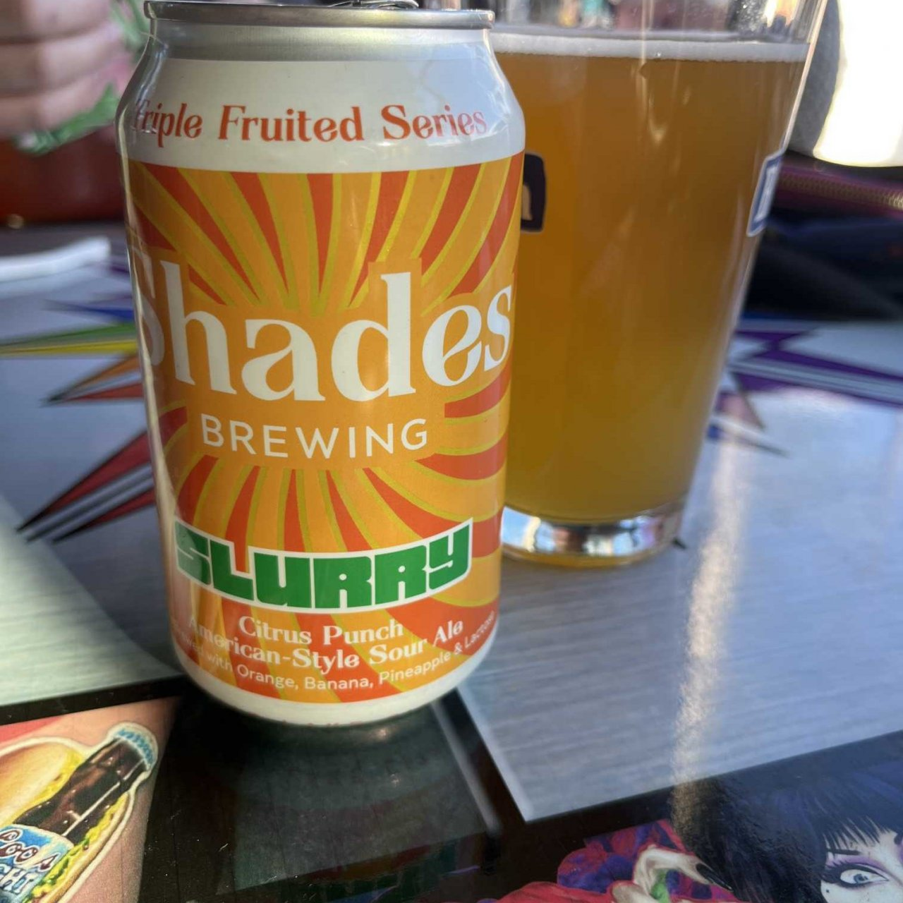

## Citrus Punch (American-Style)

Calling this one a punch is no joke. Immediately after drinking, the flavor is a kick (or punch 😂) in the mouth. Instant orange/citrus straight to the front of your mouth, almost enough to catch you off guard. The three flavors show up at different times, the orange is immediate; the banana shows up once the taste mellows, and the pineapple never came (just like my ex-wife). Overall, I'd say that this one is a little aggressive and should be a slow sipper for a long night. 

## Overall Result
⚠️ - If you are into orange/citrus this may be the drink for you.

## Disclaimer
The views and opinions expressed in this blog are those of the speakers and do not necessarily reflect the views or positions of any entities they represent.
  